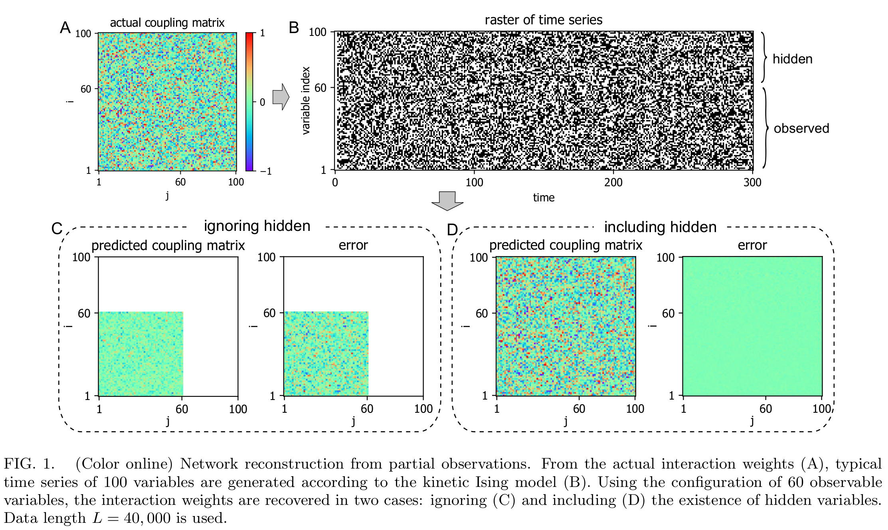
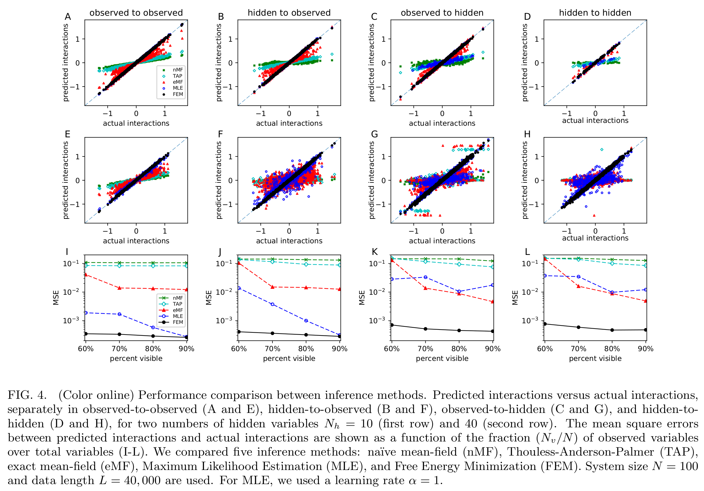
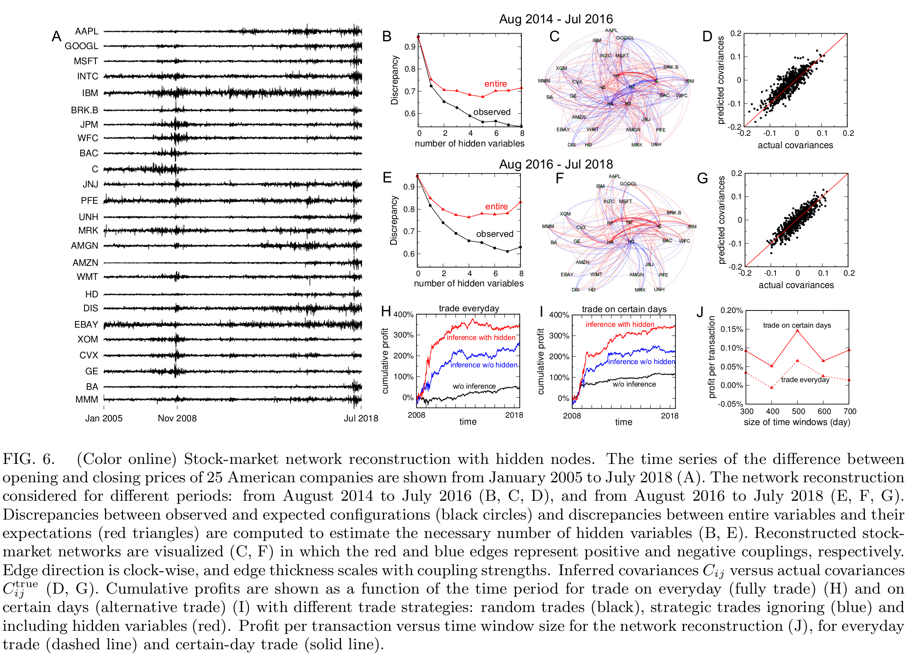
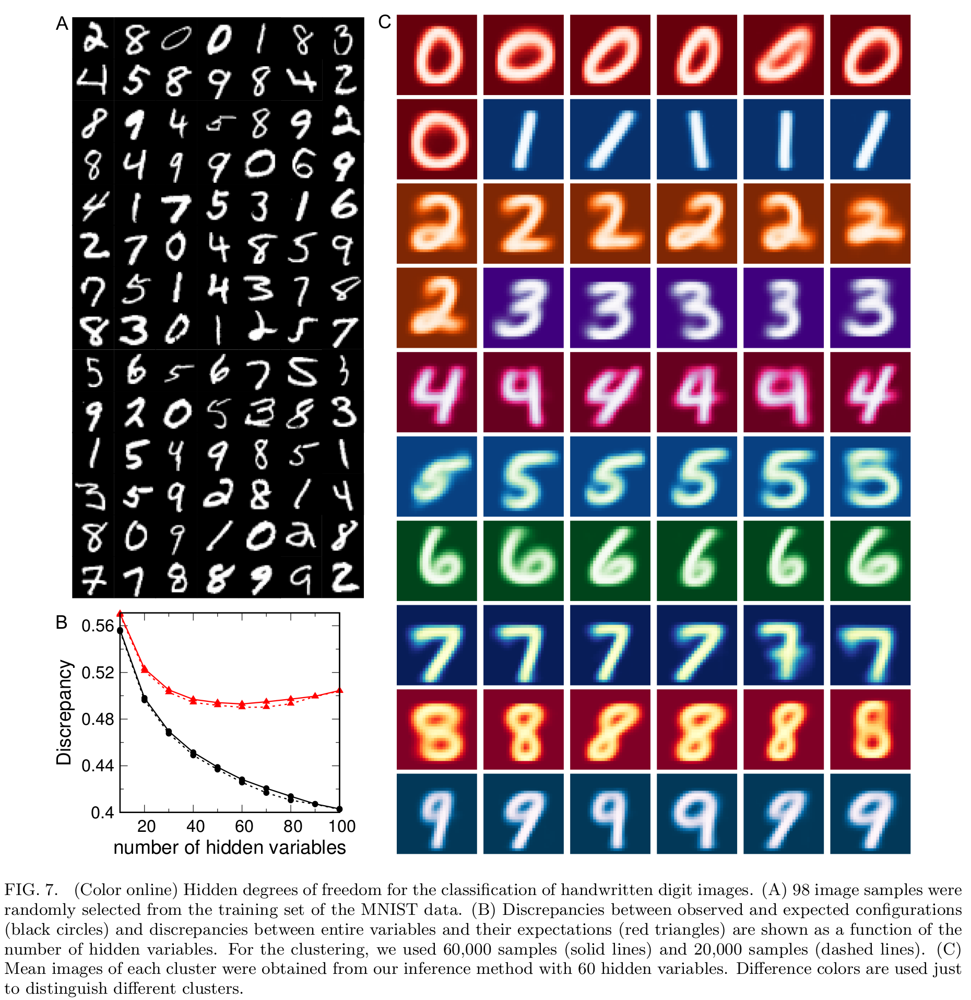

Network Inference with Hidden Variables
=======================================

Introduction
-----------------------------
This work was motivated by the fact that real-world data often contains only subsets of variables. The hidden variables can influence the observed ones; ignoring hidden variables in network inference may lead to poor prediction results. Our ultimate goal was to develop a data-driven method that can use the configurations of observed variables to infer the interactions (observed-to-observed, hidden-to-observed, observed-to-hidden, and hidden-to-hidden), the configuration of hidden variables, and the number of hidden variables.

The Jupyter notebook presents only the core idea of our method and example with simulated data. The application in analyzing of experimental data such as recording neuronal activity and stock market are shown in our paper.

Interactive notebook
-----------------------------
Use Binder to run our code online. You are welcome to change the parameters and edit the jupyter notebooks as you want. 

.. image:: https://mybinder.org/badge.svg
   :target: https://mybinder.org/v2/gh/danhtaihoang/hidden-variables/master?filepath=sphinx%2Fcodesource

Links
----------------------------
Code Documentation
    https://danhtaihoang.github.io/hidden-variable

Code Source
    https://github.com/danhtaihoang/hidden-variable

Reference
----------------------------
Danh-Tai Hoang, Junghyo Jo, and Vipul Periwal, "Data-driven inference of hidden nodes in networks" (under review), `arXiv:1901.04122 <https://arxiv.org/abs/1901.04122>`_.

Selected Figures
----------------------------
- **Network reconstruction from partial observations**

- **Performance comparison between inference methods**

- **Stock-market network reconstruction with hidden nodes**

- **Hidden degrees of freedom for the classification of handwritten digit images**

